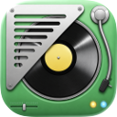

# Navic

<p align="center">
  
</p>

<p align="center">
  <strong>A macOS menu bar widget for Navidrome and Apple Music now playing.</strong><br>
  Navic shows the current track, artwork, and playback state in a compact floating widget.
</p>

<p align="center">
  <a href="https://github.com/artp1ay/Navic/actions/workflows/ci.yml"></a>
  <a href="LICENSE"></a>
  
</p>

<p align="center">
  
</p>

## What It Does

Navic is a small macOS companion that mirrors what you're listening to in a floating now-playing widget. Pick your source on the Source tab: a remote Navidrome server (Subsonic API) or the Music app running on this Mac. Auto mode switches between them based on whichever is currently playing.

- Shows title, artist, album, artwork, and playback state.
- Sources: Navidrome (Subsonic API), Apple Music (local Music.app), or Auto.
- Runs from the menu bar, with an optional Dock icon.
- Includes several widget layouts and visual styles.
- Can hide itself when playback is idle.
- Stores Navidrome credentials in the macOS Keychain.
- Does not control playback; it is display-only.

## Requirements

- macOS 14.6 or later.
- At least one source:
  - A Navidrome server with Subsonic API access enabled, and/or
  - The Music app on this Mac (for the Apple Music source).
- Xcode 26 or later for development.

## Installation

### Homebrew

```sh
brew tap artp1ay/navic
brew install --cask navic
```

### Manual Download

Download the right DMG from [Releases](https://github.com/artp1ay/Navic/releases):

- `Navic-1.0-arm64.dmg` for Apple Silicon Macs.
- `Navic-1.0-x86_64.dmg` for Intel Macs.

Open the DMG, drag `Navic.app` to `Applications`, then launch it.

The current release artifacts are unsigned. macOS may ask you to confirm that you want to open the app.

## Setup

1. Open Navic.
2. Choose Settings from the menu bar item.
3. On the **Source** tab, pick Navidrome, Apple Music, or Auto.
   - **Navidrome:** enter your server URL, username, and password.
   - **Apple Music:** the first time Navic queries Music, macOS will ask you to grant automation access — accept it. You can revoke it later in System Settings → Privacy & Security → Automation.
   - **Auto:** uses Music when it's playing, falls back to Navidrome otherwise.
4. Pick the widget style you want to use.

## Development

Open `navic.xcodeproj` in Xcode and run the `navic` scheme.

Run tests:

```sh
xcodebuild test \
  -project navic.xcodeproj \
  -scheme navic \
  -destination 'platform=macOS'
```

Build local DMGs:

```sh
Scripts/build_dmg.sh arm64
Scripts/build_dmg.sh x86_64
```

Build output is written to `build/`.

## Contributing

Issues and pull requests are welcome. Please keep changes focused and avoid committing local build output, credentials, or Xcode user state.

## License

Navic is released under the MIT License. See [LICENSE](LICENSE).
